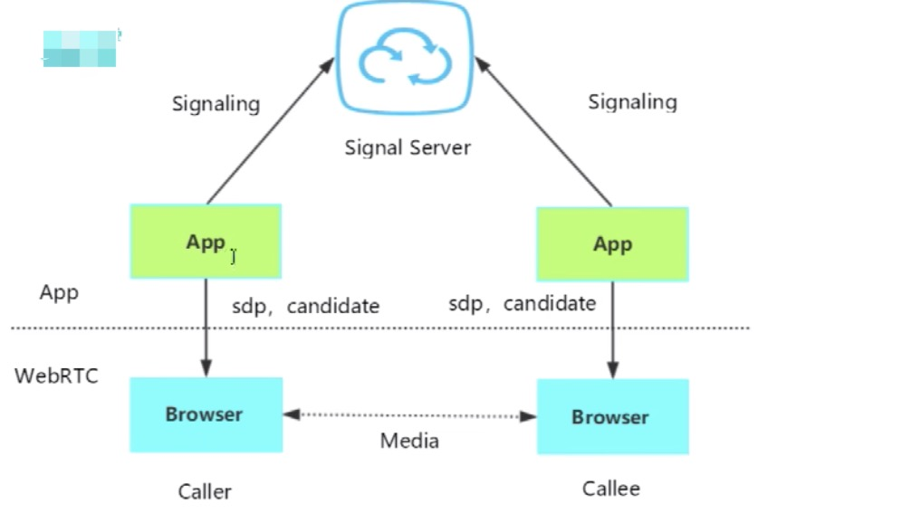

## WebRTC 通话原理

两个不同网络环境的(具备摄像头/麦克风多媒体设备的)浏览器，要实现点对点的实时音视频对话，难点在哪里？

### 1.媒体协商: 交换 SDP 信息

彼此要了解对方支持的媒体格式

比如，Peer-A 端可支持 VP8、H264 多种编码格式，而 Peer-B 端支持 VP9、H264，要保证二端都正确的编解码，最简单的办法就是取他们的交集 H264。

> 有一个转门的协议，称为 Session Description Protocol(SDP)，可用于描述上述这类信息。在 WebRTC 中，参与视频通讯的双方必须先交换 SDP 信息，这样双方才能知根知底，而交换 SDP 的过程，也称为媒体协商

### 2.网络协商：candidate

彼此要了解对方的网络情况，这样才有可能找到一条相互通讯的链路：

- 获取外网 IP 地址映射
- 通过信令服务器(signal server)交换“网络信息”

理想的网络情况是每个浏览器的电脑都是私有公网 IP，可以直接进行点对点连接。如下图，通过信令服务器交换信息，然后直接点对点通信

实际情况是，我们的电脑和电脑之间或大或小都是在某个局域网中，需要 NAT(Network Address Translation，网络地址转换)，显示情况如下图：

NAT 转换其实就是通过端口映射的方式进行转换

Peer-A 在局域网内的 ip 是 10.1.1.2，公网 IP 是 113.246.153.54，对应的公网端口是 60，即 Peer-A 需要通过公网 113.246.153.54:60 通信。

同理，Peer-B 需要通过公网 113.246.155.54:60 和 Peer-A 进行通信。

因此，Peer-A 和 Peer-B 如何拿到外网 IP 和端口？毕竟处于局域网内的设备本身是不清楚自己的端口映射的，需要通过服务器获取的。具体流程是：

客户端连接到服务器，服务器知道这个外网 IP 和端口，服务器再把外网 IP 和端口返回给客户端

> 在解决 WebRTC 使用过程中的上述问题时，我们需要用到 STUN 和 TURN

#### STUN

STUN（Session Traversal Utilities for NAT，NAT 会话穿越应用程序）是一种网络协议，它允许位于 NAT（或多重 NAT）后的客户端找出自己的公网地址，查出自己位于哪种类型的 NAT 之后以及 NAT 为某一个本地端口所绑定的 Internet 端端口。这些信息被用来在两个同时处于 NAT 路由器之后的主机之间创建 UDP 通信

> 在遇到上述情况的时候，我们可以建立一个 STUN 服务器，这个服务器做什么用的呢？主要是给无法在公网环境下的视频通话设备分配公网 IP 用的。这样两台电脑就可以在公网 IP 中进行通话

> 局域网 IP 绑定的是外网 IP + 端口

STUN 服务器工作流程

使用一句话说明 STUN 做的事情就是：告诉我你的公网 IP 地址是什么。搭建 STUN 服务器很简单，媒体流传输是按照 P2P 的方式

**那么问题来了，STUN 并不是每次都能成功的为需要 NAT 的通话设备分配 IP 地址的，P2P 在传输媒体流程时，使用的本地带宽，在多人视频通话的过程中，通话质量的好坏往往需要根据使用者本地的带宽确定，那怎么办？TURN 可以很好的解决这个问题**

#### TURN

TURN 的全称为 Traversal Using Relays around NAT，是 STUN/RFC5389 的一个拓展，主要添加了 Relay 功能。如果终端在 NAT 之后，那么在特定的情景下，有可能使得终端无法和其对等端(peer)进行直接的通信，这时就需要公网的服务器作为一个中继，对来往的数据进行转发。这个转发的协议就被定义为 TURN

在 STUN 分配公网 IP 失败后，可以通过 TURN 服务器请求公网 IP 地址作为中继地址。这种方式的带宽由服务器端承担，在多人视频聊天的时候，本地带宽压力较小，并且，根据 Google 的说明，TURN 协议可以使用在所有的环境中。

**以上是 WebRTC 中经常用到的 2 个协议，STUN 和 TURN 服务器我们使用 coturn 开源项目来搭建**

> 补充，ICE 跟 STUN 和 TURN 不一样，ICE 不是一种协议，而是一个框架，它整合了 STUN 和 TURN。coturn 开源项目集成了 STUN 和 TURN 的功能

在 WebRTC 中用来描述网络信息的术语叫 candidate

> 媒体协商：sdp。 网络协商：candidate

### 3.媒体协商+网络协商数据的交换通道

从上面 1/2 点我们知道了客户端需要交换媒体信息和网络信息，那怎么去交换？是不是需要一个中间商去做交换？所以我们需要一个信令服务器转发彼此的媒体信息和网络信息

如上图，我们在基于 WebRTC API 开发应用(APP)时，可以将彼此的 APP 连接到信令服务器(Signal Server，一般搭建在公网，或者两端都可以访问到的局域网)，借助信令服务器，就可以实现上面提到的 SDP 媒体信息及 Candidate 网络信息交互。

> 信令服务器不只是用于交换媒体信息 sdp 和网络信息 candidate，还用于：1.房间管理 2.人员进出房间

> 注意，信令服务器并不是一个标准，就是一个用于交互信息的服务，既可以是 websocket，也可以是其他 c++或其他语言实现的服务器。

### 4.WebRTC APIs

- 1.MediaStream。MediaStream 用来表示一个媒体数据流(通过 getUserMedia 接口获取)，允许你访问输入设备，如麦克风和 web 摄像机，该 API 允许从其中任意一个获取媒体流。
- 2.RTCPeerConnection。RTCPeerConnection 对象允许用户在两个浏览器之间直接通讯，你可以通过网络将捕获的音频和视频流实时发送到另一个 WebRTC 端点。使用这些 API，你可以在本地机器和远程对等点之间创建连接。它提供了连接到远程对等点、维护和监视连接以及在不再需要连接时关闭连接的方法
